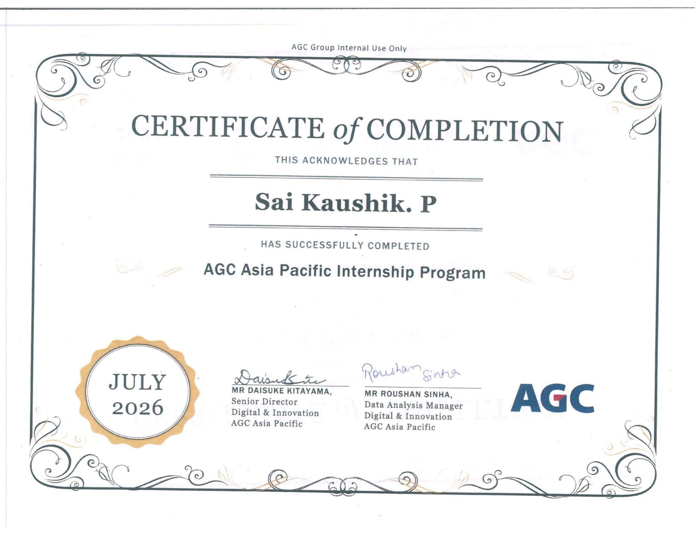
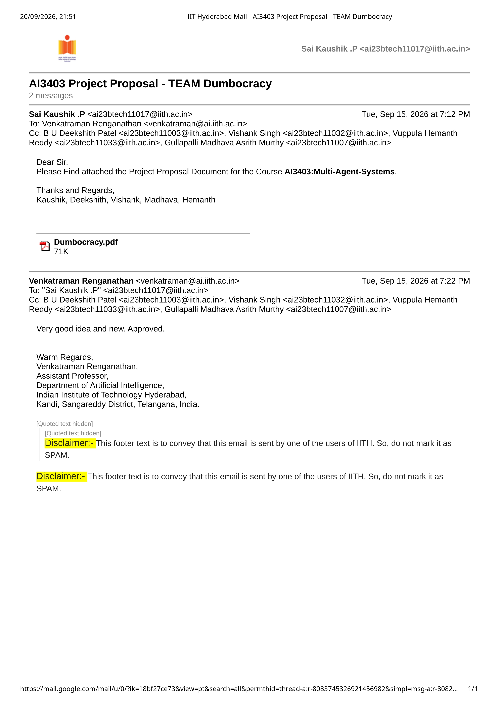
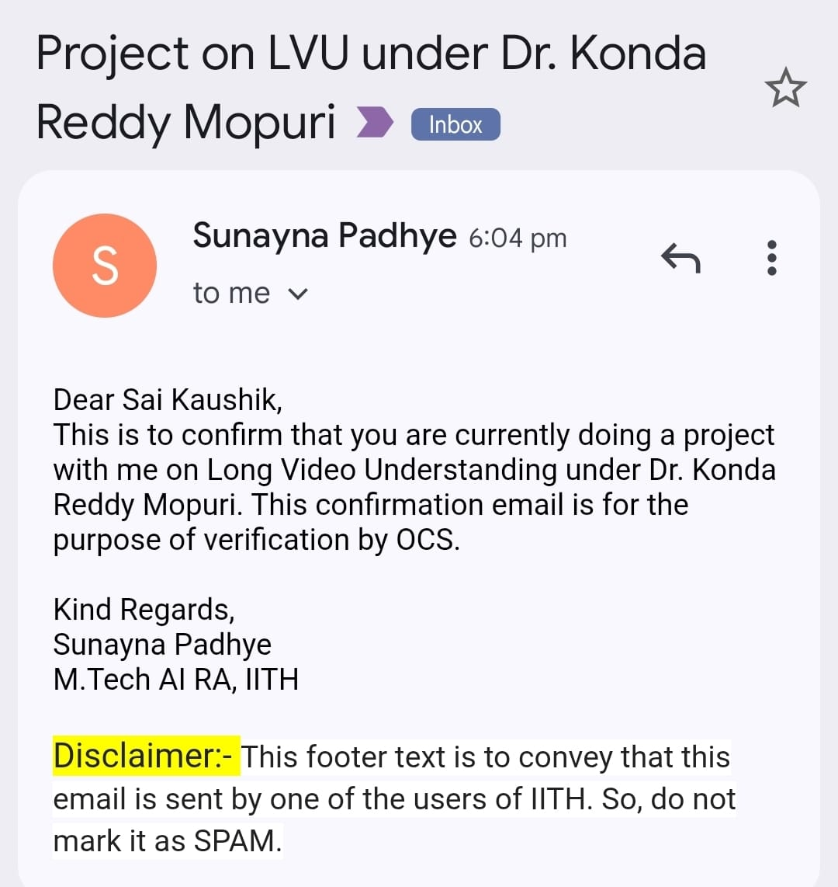

# Work Experience
1. AGC Intern 

---

# Projects

1. ONGOING COURSE PROJECT  **AdaRoute** & ONGOING COURSE PROJECT - MAS (currently not mentioned in the resume)

2. Adv. AI Techniques for Long Video Understanding

3. LogScope: [Link](https://github.com/wanderer1011/SWE_Final_Collection_Layer_G17)

4. Robust Motion Gated Adaptaion: [Link](https://github.com/saikaushhikp/RMGA-Robust-Motion-Gated-Adaptation)

5. Autonomous Trading Agent: [Link](https://github.com/vhemanth06/Financial_Decision_maker)

6. SmartReflex - The New Rehab : [Link](https://github.com/saikaushhikp/SmartReflex-The-New-Rehab)  

7. Multi-Spectral Image Segmentation(part of DL coursework) : [Link](https://github.com/saikaushhikp/DL-MultiSpectral-Image-Segmentation-Kaggle_Task) 

8. Deep-RL algorithms for Gymnasium environments(part of RL coursework) : [Deep-RL](https://github.com/saikaushhikp/Deep-RL)  

9. Generative Adversarial Networks for MNIST : [DC-GAN for MNIST](https://github.com/saikaushhikp/GANs-4-MNIST)  

10. Inventory Management System (IMS) :  [full repo](https://github.com/NagaRohithKumarJakkala/IMS)

11. Riscv-simulator:  [version 1](https://github.com/saikaushhikp/Computer-Architecture-CS2323/tree/main/Lab4)  , [version 2](https://github.com/saikaushhikp/Computer-Architecture-CS2323/tree/main/Lab7)  

    - in case the above links doesn't open, $\to$ complete repo [Computer-Architecture-CS2323](https://github.com/saikaushhikp/Computer-Architecture-CS2323)  

12. Deep Learning-Based Coin Classification : [version 1](https://github.com/saikaushhikp/CNN-based-Coin-Image-Classifier)

13. Machine Learning Algorithms from Scratch :  [version 1](https://github.com/saikaushhikp/Supervised-Learning-Scratch)

---

# Positions of Responsibility (PORs)

1. Ml-Core | Tinkeres' lab IITH
  

2. UG buddy | Sunshine IITH  

---

# extra curriculars 
1. NSS student volenteer :

<!-- 
# Ranks
1. Jee Adv  : 

2. Jee mains : 

3. AP EAMCET :
 -->
